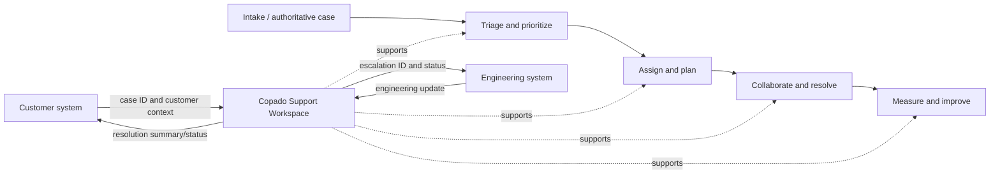

# Copado Support Application — Business Feasibility Assessment

Status: proposed business architecture assessment, 2026-08-02  
Technical references: [`phase4-architecture.md`](phase4-architecture.md) and
[`../plans/phase4_realtime_platform.plan.md`](../plans/phase4_realtime_platform.plan.md)

## Executive recommendation

**Proceed conditionally with the enhancement program.** The application is feasible
and potentially valuable as an **internal support operations workspace**: a shared
queue, personal work planning, collaboration, operational visibility, SLA risk,
and links to authoritative customer/engineering systems.

Do **not** position it yet as a full enterprise case-management replacement. That
would require customer channels, entitlements, knowledge management, compliance,
24×7 operations, mature integrations, search, attachments, automation, and a much
larger product/operations commitment. First prove that the current team uses the
Queue daily and that live collaboration, Calendar, and SLA visibility improve
measurable support outcomes.

Overall feasibility is **Amber-Green**:

| Dimension | Rating | Assessment |
|---|---|---|
| Strategic fit | Green | Strong fit if the goal is one internal workspace for queue ownership and execution |
| User desirability | Amber | Plausible, but daily adoption and workflow pain have not yet been evidenced |
| Technical feasibility | Green | Existing FastAPI/PostgreSQL foundation can evolve incrementally without a rewrite |
| Data/reporting readiness | Amber-Red | Current rows cannot reconstruct history; activity capture must precede SLA/trend reports |
| Operational feasibility | Amber | CI, observability, support ownership, recovery targets, and runbooks are not yet mature |
| Security/governance | Amber | Roles exist, but workspace/team boundaries, CSRF, audit, retention, and access reviews are needed |
| Financial feasibility | Amber-Green | Low infrastructure entry cost; people, integration, support, and change-management costs dominate |
| Delivery risk | Amber | Manageable through phased gates, feature flags, backfills, and polling fallback |

## Business problem and proposed position

### Problem to solve

Support work is valuable only when the team can reliably answer:

- What requires action now?
- Who owns it and what is blocking progress?
- What is at risk of breaching an expectation?
- What changed, who changed it, and why?
- Where must a manager rebalance capacity or escalate?
- Which system contains the authoritative customer or engineering record?

The application already addresses personal planning and basic shared ownership.
Phase 4 should close the collaboration, audit, time-management, and operational
insight gaps rather than broaden immediately into every service-management feature.

### Recommended product position

> Copado Support Workspace is the internal operating layer where support teams
> prioritize, own, collaborate on, and monitor work. External systems remain
> authoritative for customer, product, and engineering records and are connected
> through stable identifiers and integrations.

This position creates differentiation from a generic checklist while avoiding a
high-cost attempt to duplicate mature enterprise platforms.

## Stakeholders and outcomes

| Stakeholder | Job to be done | Required outcome |
|---|---|---|
| Support agent | Find and progress assigned work without checking several lists | Clear priority, ownership, context, mentions, due/SLA risk, minimal duplicate entry |
| Support manager | Keep service healthy and rebalance workload | Queue health, aging, breaches, capacity, drill-down, trustworthy history |
| Administrator | Provision users, teams, workflow, policies, and access safely | Governed configuration, audit, low operational effort |
| Leadership | Understand performance and systemic constraints | Stable KPI definitions, trends, exceptions, exportable evidence |
| Security/Compliance | Control and evidence access and retention | Least privilege, audit trail, retention, recoverability, access reviews |
| Engineering/Product liaison | Receive complete escalations and return updates | Structured handoff and linked authoritative engineering record |
| Platform/Operations | Run the service predictably | Deployability, telemetry, backups, incident ownership, cost visibility |

## Current-to-target capability map

| Business capability | Current maturity | Target after Phase 4 | Priority |
|---|---:|---:|---|
| Personal work management | 3 — working | 3 — retain and integrate lightly | Maintain |
| Shared case intake/ownership | 2 — basic | 3 — governed and team-scoped | Must |
| Case collaboration | 2 — comments/notifications | 4 — live updates, mentions, activity | Must |
| Workflow governance | 2 — hard-coded statuses | 3 — controlled configurable workflow | Should |
| Time/SLA management | 1 — due-date counts | 3 — versioned milestones and risk | Must after activity |
| Operational planning | 1 — upcoming list | 3 — Calendar plus workload visibility | Should |
| Performance insight | 1–2 — current counts | 3 — reconciled operational reports | Must after history |
| Organization/access management | 2–3 — roles/org teams | 3 — workspace/team policy and audit | Must |
| Integrations | 0 | 2 — selected linked-system adapters | Validate before build |
| Knowledge management | 0 | 1 — link externally initially | Defer |
| Customer self-service/channels | 0 | 0 — out of scope | Defer |
| Platform operations | 1 | 3 — controlled production service | Must |

Maturity scale: 0 absent, 1 initial, 2 repeatable, 3 managed, 4 measured/optimized.

## Enhancement feasibility by product surface

| Enhancement | Business value | Feasibility | Dependency | Recommendation |
|---|---|---|---|---|
| Activity log | Very high | High | Transactional domain changes | Build first; enables audit, SLA, and reports |
| Real-time updates | High for active teams | High | Activity/outbox, connection operations | Pilot behind a flag; keep polling fallback |
| Real `@mentions` | High | High | Authorized user directory, activity | Build with realtime; measure response improvement |
| Calendar | Medium-High | High | Typed due time and shared filters | Build after foundation; avoid separate calendar data |
| SLA management | High if contractual/operational targets exist | Medium | Business calendar, pause rules, history, policy owner | Build only after SLA definitions are approved |
| Reports | High for managers | Medium | Sufficient clean activity history and KPI definitions | Start operational; delay trend claims until data matures |
| Settings | Medium | Medium-High | Governance model and audit | Expose only validated configurations; avoid unlimited customization |
| Multiple teams/queues | High when teams truly need isolation | Medium-High | Workspace/team authorization | Model now; enable restrictions only after policy decisions |
| Attachments | Medium | Medium | Object storage, malware scanning, retention, privacy | Defer unless case evidence cannot be linked externally |
| Slack/Teams integration | Potentially high | Medium | Event/outbox, ownership, bot governance | Validate one workflow; avoid duplicating full conversation |
| Salesforce/Jira integration | Potentially very high | Medium | System-of-record decision, identifiers, conflict rules | Discovery first; likely more valuable than custom fields |
| Templates | Medium | High | Stable case taxonomy | Build after observing repeated case patterns |
| Custom fields | Variable | Medium | Governance, search/reporting design | Defer; begin with a small governed schema |
| Customer portal/email intake | Very high scope | Low near-term | Identity, routing, spam, threading, compliance, support | Do not include in Phase 4 |

## Value streams and system boundaries

The workspace should own internal priority, assignment, team conversation,
operational due/SLA milestones, and its audit trail. It should reference—not
silently copy and diverge from—authoritative customer/account, product defect,
and engineering delivery data.

## Options considered

### Option A — maintain the current MVP

- Lowest short-term cost.
- Suitable for a very small team with low case volume.
- Leaves polling, audit, concurrency, SLA, reporting, and recovery limitations.
- Creates increasing data/operational risk if adoption grows.

**Assessment:** acceptable only as a temporary internal tool with no formal SLA reliance.

### Option B — incrementally enhance as an internal operations workspace

- Reuses the current investment and preserves user familiarity.
- Delivers the highest-value missing capabilities in controlled slices.
- Allows integration with authoritative enterprise systems.
- Requires explicit ownership, adoption work, production controls, and KPI governance.

**Assessment:** recommended.

### Option C — replace with/configure an established service-management platform

- Gains mature intake, SLA, automation, knowledge, integrations, compliance, and support.
- Adds licensing, configuration, migration, vendor dependency, and possible workflow friction.
- May be economically superior if requirements expand toward external customer service.

**Assessment:** keep as an active benchmark. Reassess before building customer portal,
email ingestion, broad automation, knowledge base, or complex omnichannel features.

### Option D — build a complete enterprise support platform

- Maximum control but the largest product, compliance, integration, and operational burden.
- Duplicates commodity capabilities and distracts from distinctive support workflows.

**Assessment:** not feasible or justified with current evidence.

## Economic feasibility framework

Do not approve the full roadmap using infrastructure cost alone. The main cost is
ongoing people capacity: product ownership, engineering, QA, operations, security,
training, data governance, integration maintenance, and user support.

### Cost categories to estimate at Gate 0

- Initial delivery capacity per release and opportunity cost versus support work.
- Managed PostgreSQL, staging, monitoring/error tracking, backups, and optional Redis.
- OAuth/integration administration and external API maintenance.
- Security review, restore exercises, incident response, and patching.
- User discovery, training, documentation, adoption support, and workflow transition.
- Annual maintenance budget for defects, dependencies, schema changes, and reports.

### Benefits to baseline and measure

- Agent time spent finding ownership/status/context.
- Number and age of unassigned or stale cases.
- Handoff delay and mention/assignment response time.
- SLA/due-date misses and avoidable escalations.
- Manager time assembling operational reports.
- Duplicate data entry between the workspace and authoritative systems.
- Rework caused by conflicting updates or missing history.

### Investment test

Proceed beyond the pilot when the annualized value of demonstrated time savings,
risk reduction, and service improvement exceeds estimated build/run/change cost
by the organization's required investment threshold. Do not invent a return figure
before baselines, loaded labor cost, and adoption are known.

## Pilot and benefits-realization plan

### Stage 1 — discovery and baseline (2–3 weeks)

- Interview representative agents, managers, admins, operations, and security.
- Map the actual case lifecycle and every current system/spreadsheet/message handoff.
- Baseline adoption, queue volume, aging, unassigned cases, due misses, handoff time,
  manager reporting effort, and duplicate entry.
- Decide the authoritative system for customer case, engineering issue, and identity data.
- Approve KPI definitions, workspace/team visibility, SLA rules, RPO/RTO, and retention.

### Stage 2 — foundation and activity pilot

- Deliver Release 4.1 and activity shadow writes to a small internal cohort.
- Reconcile activity completeness and assess workflow fit without changing reports.
- Confirm agents use Team Queue for real daily work rather than parallel tracking.

### Stage 3 — realtime, mentions, and Calendar pilot

- Enable features for one team with polling fallback.
- Train users on ownership, mentions, and due-date hygiene.
- Compare response/handoff time, stale work, active usage, and defects against baseline.

### Stage 4 — SLA/Reports decision

- Proceed only when activity data is sufficiently complete and business policy owners
  approve SLA/KPI definitions.
- Publish reports initially as operational decision aids, with formula/data-quality notes.
- Expand team-by-team after adoption, reliability, security, and benefit gates pass.

## Business acceptance gates

| Gate | Evidence required | Decision |
|---|---|---|
| 0 — invest | Named sponsor/owners, target users, pain baseline, scope, SLO/RPO/RTO/retention, system-of-record decisions | Fund foundation or stop |
| 1 — trust | Isolation/security tests, reconciled migration/activity, no data loss, acceptable latency | Allow live pilot |
| 2 — adopt | ≥80% of pilot team's active shared cases managed in Queue; weekly active use; reduced parallel tracking | Expand realtime/Calendar or revise workflow |
| 3 — benefit | Improvement in at least two agreed outcome KPIs without material control/reliability regression | Fund SLA/Reports |
| 4 — scale | Operating owner, runbooks/alerts, restore proof, support model, sustainable run cost, security approval | Expand to more teams |

The 80% threshold is a proposed decision rule, not a current measurement. Leadership
should approve or replace it at Gate 0.

## KPI framework

### Adoption and behavior

- Weekly active agents / provisioned agents.
- Percentage of active shared cases with current assignee, status, priority, and due/SLA data.
- Percentage of pilot cases managed only in the agreed workflow versus parallel trackers.
- Queue/detail/Calendar usage and mention response rate.

### Service outcomes

- Median and p90 time to assignment, first action, and resolution.
- Unassigned cases older than the agreed threshold.
- Open-case aging distribution and stale-case rate.
- Due/SLA warning and breach rate by priority/team.
- Reopen and handoff rates.

### Efficiency and quality

- Manager reporting preparation time.
- Duplicate entry per case and integration reconciliation errors.
- Conflicting-update rate and missing-history incidents.
- Support questions/defects per active user after each release.

### Platform health

- Availability, command/query latency, realtime delivery delay, outbox age, error rate.
- Failed deployments, restore success, security findings, and access-review exceptions.

Avoid using raw case count per agent as an individual productivity score. It can
drive gaming and ignores severity, complexity, collaboration, and customer outcome.

## Operating model required for long-term viability

| Accountability | Required responsibility |
|---|---|
| Business owner | Funding, scope, benefit realization, policy decisions |
| Product owner | Discovery, prioritized backlog, acceptance, adoption, release communication |
| Service owner | Availability, incident/change/problem management, run cost, lifecycle |
| Data/KPI owner | Definitions, quality, report certification, retention |
| Technical owner | Architecture, maintainability, performance, dependency lifecycle |
| Security/privacy owner | Threat/control review, access review, audit, retention/deletion |
| Team managers | Workflow compliance, data hygiene, coaching, SLA exception ownership |

Without named business, product, service, and data owners, the application should
remain a limited pilot; technology alone cannot make it a sustainable operational service.

## Final recommendation and next decision

Approve **Stage 1 discovery and baseline** plus the technical foundation design.
Condition funding for later features on evidence:

1. The Queue is or can become the team's daily shared operating surface.
2. A clearly named authoritative system exists for customer and engineering records.
3. Activity data is complete enough to support auditable measurement.
4. Realtime/Calendar improve response, handoff, or risk visibility in the pilot.
5. Named owners accept the run, security, data, recovery, and adoption obligations.

If these conditions are met, Phase 4 is a sensible incremental investment. If the
required scope shifts toward full external customer service, run a structured
buy/configure-versus-build assessment before adding more custom platform capability.

