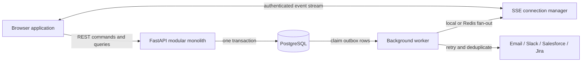

# Copado Support Phase 4 Architecture

Status: proposed baseline, reviewed 2026-08-02

## Executive decision

Keep a **modular monolith**: browser UI → FastAPI → PostgreSQL. Add immutable
case activity, a transactional outbox, a small background worker, and authenticated
Server-Sent Events (SSE). Do not add microservices, Kafka, or a separate analytics
database yet. This supplies reliable collaboration and auditable reporting while
preserving one deployment and one transaction boundary.

The application is a healthy MVP, not yet a long-running multi-team platform.
Queue mutations, comments, dashboard counts, roles, org teams, and durable
notifications work. “Realtime” currently means client polling; case history is
not stored, dates are strings, queue queries are globally scoped, schema changes
run at startup, and concurrent edits silently overwrite one another.

## Current architecture review

### Keep

- FastAPI and SQLAlchemy for the service layer.
- PostgreSQL as the production source of truth; SQLite only for local development/tests.
- Personal My Tasks/Diary/History separate from shared Team Queue cases.
- Session auth, provisioned users, roles, org teams, and durable notification inbox rows.

### Risks to remove before SLA and Reports

| Priority | Current condition | Required response |
|---|---|---|
| P0 | Queue/org data has no workspace boundary; authenticated users broadly see/update cases | Add workspace ownership, team scope, and centralized authorization/query policies |
| P0 | No immutable case history | Record every mutation as case activity; Reports and SLA consume it |
| P0 | `create_all` plus partial startup alterations | Use Alembic and a release-step migration workflow |
| P1 | Notifications poll every 30 seconds | Add SSE with durable cursor, heartbeat, reconnect, and polling fallback |
| P1 | Due dates/tags are strings | Use `timestamptz` and normalized tag relations |
| P1 | No write version/precondition | Add integer version and return `409 Conflict` for stale edits |
| P1 | Case counter is application read/increment | Use a database sequence or locked workspace counter |
| P1 | Serialization performs repeated user/comment lookups | Use eager loading/projections and measured indexes |
| P2 | Lists are capped rather than paginated | Use cursor pagination and bounded indexed filters |
| P2 | Smoke tests only; no CI/observability/runbooks | Add test layers, CI, operational telemetry, backup and restore drills |

## Target logical architecture



Initially, the worker can be a second process from the same codebase and claim
outbox rows using PostgreSQL `FOR UPDATE SKIP LOCKED`. With one web instance it
may notify an in-process SSE manager. Introduce Redis pub/sub only when multiple
web instances need fan-out or measurements justify it. PostgreSQL remains the
durable event cursor; Redis must never be the only event copy.

### Backend module boundaries

```text
backend/
  identity/       users, sessions, roles
  workspaces/     membership, teams, authorization policies
  cases/          cases, comments, mentions, activity, case queries
  notifications/ inbox and delivery preferences
  realtime/       SSE auth, cursor, heartbeat, fan-out
  calendar/       date-range projection over authorized cases
  sla/            policies, calendars, milestones, evaluation
  reports/        operational read models and exports
  integrations/   outbox consumers and provider adapters
```

Routers validate transport data and call application services. Services own
authorization and transactions. Query objects own SQL. Domain mutation code
never calls Slack, email, or another remote system inside the request transaction.

## Canonical data model

| Entity | Essential fields and constraints |
|---|---|
| `workspaces` | slug unique, name, timezone, timestamps |
| `workspace_members` | `(workspace_id, user_id)` unique, role, active flag |
| `teams` / `team_members` | workspace-scoped team name and membership |
| `cases` | workspace/team, case number unique per workspace, reporter/assignee, workflow state, priority, `due_at`, resolved/closed timestamps, integer version |
| `case_comments` | workspace/case, author, body, timestamps and policy-driven soft-delete metadata |
| `comment_mentions` | `(comment_id, user_id)` unique; structured recipients, not delivery-time text parsing |
| `case_activities` | workspace/case, actor, type, JSON before/after payload, occurred time, request/correlation ID; append-only |
| `notifications` | workspace/user, activity reference, kind, read timestamp; recipient/activity/kind unique |
| `outbox_events` | event/topic/aggregate/version, JSON payload, occurred/published times, attempts/error; aggregate/version/topic unique |
| `sla_policies` | workspace, version, applicability, targets, effective range |
| `sla_milestones` | case/policy-version/type, target, achieved/breached timestamps, status |

Minimum indexes: cases on `(workspace_id, updated_at desc)`, `(workspace_id,
team_id, status, updated_at desc)`, `(workspace_id, assignee_id, status)`, and
`(workspace_id, due_at)`; activities on `(workspace_id, case_id, id)`;
notifications on `(user_id, read_at, created_at desc)`; outbox on unpublished state and ID.

## Mutation and realtime flow

1. Client sends a command with current case version and an `Idempotency-Key` for retryable creates/comments.
2. API authenticates the session and resolves workspace membership plus case/team permission.
3. Service conditionally updates the case, increments version, and writes activity,
   notification rows, and an outbox event in one PostgreSQL transaction.
4. API returns the representation/version; a stale version returns `409` plus current version.
5. Worker claims outbox rows, fans events to clients, runs external adapters, and
   records delivery. Consumers deduplicate using event ID.
6. SSE reconnect uses `Last-Event-ID` to replay authorized events after the cursor,
   then receives live delivery. UI handlers invalidate/refetch affected views.

SSE fits because Phase 4 needs server-to-browser invalidation, not bidirectional
socket commands. REST remains the command path, simplifying auth, retries, tests,
and audit behavior.

## Calendar, SLA, and Reports rules

Calendar is a projection, not another task store. Its range endpoint calls the
same authorized case query as Team Queue and filters `due_at >= start AND due_at < end`.
Store UTC; workspace timezone defines reporting/business-day boundaries; user
timezone controls display.

SLA policies are versioned. Store the selected policy version and computed
milestones with each case so settings changes never rewrite history. A worker
emits idempotent warning/breach activities. Business hours and holidays are
workspace calendar data, never browser-only calculations.

Reports derive from activities and milestone facts: opened/resolved volume,
first-response and resolution percentiles, breach rate, workload/aging, status
dwell time, and reopen rate. Start with indexed PostgreSQL. Add rollups or
materialized views only after query plans/latency metrics justify them. Run large
CSV exports as bounded background jobs.

## Security and operations

- Enforce workspace/team access inside services and query objects, not only UI/routes.
- Add CSRF protection for cookie-authenticated mutations; keep secure HTTP-only cookies.
- Rate-limit login, comments, exports, and event reconnects.
- Audit role, impersonation, org, workflow, SLA, and integration-setting changes.
- Keep secrets and full sensitive comment bodies out of logs and integration events.
- Emit structured logs with request/correlation/user/workspace IDs. Measure latency,
  errors, DB pool pressure, SSE connections/reconnects, outbox age/failures,
  worker lag, notification delay, and SLA evaluation lag.
- Take encrypted retained PostgreSQL backups and perform quarterly isolated restore drills.

## Quality and rollout gates

Every increment needs migration rollback notes, API contract tests, workspace
isolation tests, and browser behavior tests. Realtime adds reconnect, duplicate,
and out-of-order tests. Calendar adds DST/timezone range tests. SLA/Reports add
policy-version and reconciliation tests.

Release progressively: shadow-write activity/outbox while polling stays primary;
validate completeness; feature-flag SSE; enable it internally with polling fallback;
release Calendar after date backfill reconciliation; expose trends only after
enough trustworthy history exists. Never fabricate historical metrics from current rows.

## Architecture decision triggers

- Add Redis when multiple web processes need fan-out or PostgreSQL notification load is material.
- Add an analytics store only when indexed PostgreSQL plus rollups cannot meet an agreed report SLO without harming transactions.
- Extract a service only for an independent scaling, reliability, or deployment need with a stable boundary.
- Replace the plain JavaScript UI only if measured Phase 4 state complexity slows delivery; backend contracts remain framework-independent.

