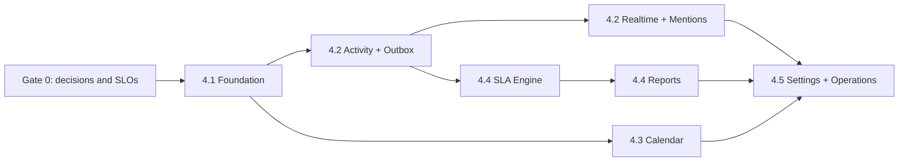

# Phase 4 real-time platform execution plan

Architecture reference: [`docs/phase4-architecture.md`](../docs/phase4-architecture.md)  
Historical product roadmap: [`team_app_features_c9321044.plan.md`](team_app_features_c9321044.plan.md)

## Project charter

### Goal

Turn the existing working Team Queue into a production-grade shared support system
where authorized users see committed changes within two seconds, every business
change is auditable, and Calendar/SLA/Reports agree with Queue data.

### Non-goals for Phase 4

- No microservice split, Kafka, event sourcing rewrite, or analytics warehouse.
- No replacement of the current frontend solely for technology preference.
- No external integration inside a case request transaction.
- No fabricated historical SLA or resolution metrics before activity capture begins.
- No attachments, arbitrary custom fields, or open signup until the core platform is stable.

## Leadership decisions required before implementation

| Decision | Proposed default | Owner | Deadline |
|---|---|---|---|
| Workspace model | One default workspace now; schema supports more later | Product + Architecture | Gate 0 |
| Team visibility | Workspace-wide read initially; optional team-restricted queues via policy | Product + Security | Gate 0 |
| Production database | Managed PostgreSQL; SQLite unsupported in production | Engineering | Gate 0 |
| Realtime transport | SSE for browser delivery, REST for commands | Architecture | Approved by this plan |
| Availability target | 99.9% monthly after Phase 4.2 stabilization | Product + Operations | Gate 0 |
| Recovery objectives | Proposed RPO ≤ 24 h and RTO ≤ 4 h initially | Business + Operations | Gate 0 |
| Data retention | Activity retained for at least 13 months; finalize with policy owner | Security/Compliance | Gate 0 |
| Workspace timezone | `Asia/Kolkata` default, configurable per workspace | Product | Gate 0 |

## Delivery model and critical path



Activity capture is the critical dependency for trustworthy reports. Typed time
and shared authorization are the critical dependencies for Calendar. Realtime can
be enabled after shadow-event completeness is proven; it does not block Calendar UI work.

## Release 4.0 — baseline and controls

### Deliverables

- Record Architecture Decision Records for modular monolith, SSE, transactional
  outbox, workspace boundary, and UTC time handling.
- Confirm expected active users, concurrent sessions, case volume, retention,
  availability, recovery, and data residency requirements.
- Capture baseline API latency, notification polling load, database size, and slow queries.
- Add feature flags: `activity_write`, `realtime_sse`, `mentions`, `calendar`, `sla`, `reports`.
- Define environments: local, test, staging, production; use separate databases and secrets.

### Exit gate

Named owners approve the decisions above; staging exists; current tests pass;
baseline measurements and rollback contacts are recorded.

## Release 4.1 — trustworthy domain foundation

### Database and migration work

1. Add Alembic and baseline the current schema without destroying existing data.
2. Add `workspaces` and `workspace_members`; create one default workspace and
   backfill all current users/data.
3. Scope org teams, cases, notifications, and new entities to `workspace_id`.
4. Add case `team_id`, `due_at timestamptz`, `version integer default 1`, and
   resolution/closure timestamps. Dual-read/dual-write the legacy due-date field
   during the migration window, reconcile, then remove it in a later release.
5. Replace the application case counter with a transaction-safe workspace sequence/counter.
6. Add query indexes described in the architecture and verify PostgreSQL query plans.

### Application work

- Centralize workspace/team authorization in services/query policies.
- Require the current version on case edits; return `409` and the current case on conflict.
- Support an `Idempotency-Key` for create-case and add-comment requests.
- Replace fixed 200-row caps with cursor pagination while retaining a bounded maximum page size.
- Eager-load/project reporters, assignees, and comment counts to remove N+1 behavior.
- Move FastAPI startup logic to lifespan; migration execution remains a deployment step.
- Add CSRF controls for cookie-authenticated mutations.

### Exit gate

- Forward migration succeeds on a sanitized production-size copy and rollback is documented.
- Backfill reconciliation has zero missing/duplicate workspace or due-date records.
- Cross-workspace and team-policy tests prove isolation on every case/comment/notification endpoint.
- Concurrent case creation produces unique numbers; stale edits cannot overwrite newer work.
- Queue p95 stays below 500 ms at agreed test load.

## Release 4.2 — activity, realtime, and mentions

### Event contract

Use a versioned envelope. Payloads contain identifiers and safe change summaries,
not secrets or unrestricted comment bodies.

```json
{
  "event_id": "01J...",
  "schema_version": 1,
  "event_type": "case.status_changed",
  "workspace_id": 1,
  "aggregate_type": "case",
  "aggregate_id": 1053,
  "aggregate_version": 8,
  "actor_id": 12,
  "occurred_at": "2026-08-02T10:15:30Z",
  "correlation_id": "request-id",
  "data": {"from": "new", "to": "investigating"}
}
```

Initial event types: `case.created`, `case.updated`, `case.assigned`,
`case.status_changed`, `case.priority_changed`, `case.due_changed`,
`comment.created`, `mention.created`, `notification.created`, and later
`sla.warning` / `sla.breached`.

### Backend work

- Write immutable `case_activities` and `outbox_events` in the same transaction
  as every case/comment mutation.
- Provide `GET /api/cases/{id}/activities?after=&limit=` with authorized cursor paging.
- Run a separately deployable worker from the same repository. Claim rows using
  `FOR UPDATE SKIP LOCKED`, retry with exponential backoff, and dead-letter after
  a configured attempt threshold with operator visibility.
- Provide `GET /api/events/stream`; authenticate via the existing session, authorize
  each replay/live event, send heartbeat comments, honor `Last-Event-ID`, bound
  replay windows, and force refetch when a cursor is too old.
- Guarantee at-least-once delivery; clients and consumers deduplicate by event ID.

### Frontend work

- Maintain one `EventSource` per browser tab and expose connected/reconnecting/offline state.
- On an event, invalidate/refetch only affected Queue, case detail, Dashboard,
  Calendar, or notification data. Do not blindly append untrusted event payloads to UI state.
- Debounce bursts and use existing 30-second polling only while SSE is unavailable.
- Add an Activity panel ordered by immutable activity cursor.
- Add mention suggestions from authorized workspace users, send selected user IDs
  with comments, persist `comment_mentions`, and deduplicate mention notifications.

### Exit gate

- Two sessions observe committed changes with p95 delivery below two seconds.
- Disconnect/reconnect replays missed events; duplicates and out-of-order delivery
  do not corrupt the UI.
- Outbox age remains below 60 seconds and failed events are visible/replayable.
- Activity completeness reconciliation shows one correct domain activity per mutation.
- Unauthorized users cannot subscribe to or replay another workspace/team's events.

## Release 4.3 — Calendar

### Scope

- Month and week views for shared cases with due dates.
- Filters for team, assignee, status, priority, and “mine”.
- Open case detail from a calendar item; optionally move a due date with the same
  version/conflict behavior as Queue editing.
- Range API uses half-open intervals and the same case query/authorization service as Queue.

### Exit gate

- Queue and Calendar return identical authorized cases for matching filters/ranges.
- UTC, workspace timezone, user display timezone, DST, month-end, and leap-day tests pass.
- Range queries meet p95 target and use the due-date index.
- Calendar updates live through the Phase 4.2 event path and degrades to polling.

## Release 4.4 — SLA and Reports

### SLA scope

- Versioned policies by priority/team with effective dates.
- Workspace business hours, holidays, pause rules, first-response and resolution targets.
- Persisted case milestones bound to the selected policy version.
- Idempotent evaluator emitting warning/breach activities and notifications.

### Reports scope

- Opened/resolved volume, current workload/aging, first-response/resolution
  percentiles, SLA breach rate, status dwell time, and reopen rate.
- Filters by bounded date range, team, priority, status, and assignee.
- CSV export; large exports run in background with authorization rechecked at download.
- Start with indexed PostgreSQL queries. Add rollups only when query evidence demands them.

### Exit gate

- Policy edits do not change closed historical case results.
- Reports reconcile to sampled activity/milestone records and defined formulas.
- Evaluator retry/duplicate runs create no duplicate milestones or breach notifications.
- Report latency meets the agreed SLO without harming command API latency.

## Release 4.5 — Settings and production readiness

### Settings

- Workspace name/timezone, workflow states, teams/visibility, notification preferences,
  SLA policy/calendar, retention, feature flags, and integration configuration.
- Role-gate every setting and audit every privileged change.

### Operational readiness

- CI: lint/static checks, unit tests, API integration tests against PostgreSQL,
  migration tests, authorization tests, and minimal browser tests.
- Deployment: migration job → compatible app rollout → worker rollout → flag enablement.
- Observability: structured logs, request/correlation IDs, error tracking, API/DB/SSE/
  outbox/worker/SLA metrics, dashboards, actionable alerts, and synthetic health checks.
- Recovery: encrypted database backups, retention, documented restore, quarterly drill,
  and recorded achieved RPO/RTO.
- Runbooks: failed migration, SSE degradation, outbox backlog, worker poison event,
  database saturation, credential rotation, data export/deletion, and rollback.

### Final production gate

- A staged failure exercise proves polling fallback, worker recovery, and no event loss.
- Backup restoration is verified by application-level reconciliation, not only DB startup.
- Security review closes P0/P1 findings; dependency and secret scans pass.
- Product signs off Queue/Calendar/Dashboard/Reports reconciliation.
- Operations accepts dashboards, alerts, runbooks, on-call ownership, RPO, and RTO.

## API compatibility policy

- Keep existing `/api/queue/*` endpoints working during migration; introduce new
  fields additively and deprecate with a documented removal release.
- Return machine-readable errors with `code`, `message`, `request_id`, and optional details.
- Use event `schema_version`; consumers ignore unknown fields and reject unsupported major versions.
- Never reuse event types with different meaning. Add a new type/version instead.
- Publish OpenAPI changes and example payloads as part of each pull request.

## Testing strategy

| Layer | Purpose |
|---|---|
| Unit | authorization policies, status transitions, SLA time calculation, event generation |
| PostgreSQL integration | transactions, migrations, indexes, locks, idempotency, outbox claiming |
| API contract | auth, pagination, `409`, event envelopes, error schema, workspace isolation |
| Realtime integration | replay, heartbeat, reconnect, duplicate, ordering, cursor expiry, access revocation |
| Browser | queue/detail live refresh, mention UX, Calendar filters/timezones, fallback behavior |
| Performance | case commands, queue filters, SSE fan-out, dashboard/report queries, worker throughput |
| Recovery | migration rollback notes, backup restore, outbox replay, poison-event handling |

## Team ownership

One person may hold multiple roles, but each responsibility must be explicitly named.

| Role | Accountable for |
|---|---|
| Product lead | workflow/SLA/report definitions, visibility policy, acceptance and rollout |
| Technical lead | ADRs, contracts, sequencing, code review, performance budget |
| Backend owner | migrations, authorization, cases/activity/outbox/SLA/report services |
| Frontend owner | event client, conflict UX, Activity, mentions, Calendar, accessibility |
| Quality owner | test matrix, reconciliation, performance and failure exercises |
| Operations owner | environments, deploys, telemetry, alerts, backups, incident runbooks |
| Security/privacy owner | threat review, retention, audit scope, access and data handling |

## Weekly project controls

- Review milestone burn-up, critical-path blockers, migration/data risks, and decisions due.
- Demonstrate an end-to-end working slice; avoid reporting backend/UI completion separately.
- Track four engineering health signals: failed deployment rate, escaped defects,
  outbox/event lag, and p95 command/query latency.
- Maintain a decision log and risk register with owner, mitigation, trigger, and due date.
- Do not mark a milestone complete until its exit gate and operational documentation pass.

## Principal risks

| Risk | Mitigation | Trigger/escalation |
|---|---|---|
| Cross-workspace exposure | centralized policies plus negative isolation tests | Any isolation failure blocks release |
| Backfill/data loss | expand/migrate/contract, reconciliation, tested backup | Any unexplained count mismatch blocks migration |
| Lost/duplicate realtime events | transactional outbox, durable cursor, idempotent consumers | Event completeness below 100% blocks SSE flag |
| SSE instability behind proxies | heartbeat, proxy timeouts, reconnect, polling fallback | Reconnect/error SLO breach keeps fallback primary |
| Report disagreement | canonical definitions and activity reconciliation | Material mismatch blocks report publication |
| Premature infrastructure complexity | decision triggers and measured thresholds | New broker/service needs an approved ADR |

