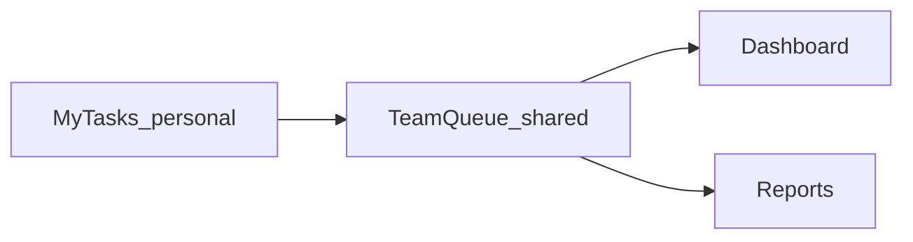

# Scaling to a Team App — what to add

## Where you are

You already have the **foundation for multi-user**:

- Auth (Admin + OAuth), Admin user provisioning
- App shell (sidebar stubs for Dashboard / Team Queue / Calendar / Reports)
- Personal **My Tasks** checklist (per-user state in SQLite)

What you do **not** have yet is **shared work**: one task visible to the whole team, with assignee, status, and conversation. Without that, teammates can log in but each still lives in a private silo.

**Recommendation (locked):** evolve into a **Copado Support team workspace**, not “everyone shares one giant checklist.” Keep **My Tasks** personal; make **Team Queue** the shared product.

---

## Must-have for a real team MVP (Phase 2)

Build these before polish. This is the minimum for “my team can use it.”

| Feature | Why |
|---------|-----|
| **Shared Team Queue** | One list of support cases the team sees together |
| **Case IDs** (e.g. `CS-1053`) | Talk about work in Slack / standups |
| **Status workflow** | New → Investigating → Waiting → Resolved → Closed |
| **Assignee** | Who owns it; filter “My open cases” |
| **Priority + due date** | Triage and SLA pressure |
| **Create / edit / filter** | Search + Status / Priority / Assignee (as in your mockup) |
| **Comments on a case** | Handoffs without losing context |
| **Roles** | Admin / Agent (Viewer later); only Admin manages users |

**Keep as-is:** My Tasks + Diary + History for personal daily work; Admin console for users/OAuth.

**Data change:** new shared `tasks` (and `comments`) tables — do **not** overload personal checklist JSON for team cases.

---

## High value next (Phase 3)

After the queue is usable every day:

| Feature | Why |
|---------|-----|
| **Dashboard** | Counts: total / mine / overdue / due today |
| **Tasks by status** chart | Instant health of the queue |
| **Upcoming due list** | Prevents silent SLA misses |
| **@mentions or notify assignee** | When someone is assigned or commented |
| **Activity log** on a case | Status/assignee changes audited |

---

## Later (Phase 4+)

Nice for the mockup; not required to start collaborating:

- Calendar (month/week by due date)
- Multiple Teams / queues
- Reports (SLA breaches, resolution time, workload by person)
- Attachments
- Templates for common case types
- Integrations (Slack, Salesforce, Jira)
- Custom fields / SLA policies

---

## What *not* to prioritize early

- Rebuilding Admin UI to match every mockup settings tab
- Full Reports while the queue is empty
- Calendar before assignees + due dates exist on shared cases
- Open signup (keep Admin-provisioned users — safer for a support team)

---

## Suggested build order (concrete)

1. **Team Queue MVP** — CRUD cases, status, assignee, priority, due, filters, case detail + comments; wire sidebar **Team Queue**
2. **My Tasks bridge** — optional “Promote to Team Queue” from a personal item (or leave separate)
3. **Dashboard** — metrics from real queue data
4. **Notifications** — assignment + comment alerts (in-app first)
5. **Calendar / Reports / Teams** — when the queue is the daily habit

---

## Success criteria for “team can use it”

- Two agents can both see and update the same case
- A manager can filter by assignee and status
- Comments preserve handoff context
- Personal checklist still works for private daily work
- New teammates are still added only by Admin

When you want to implement, start with **Phase 2 Team Queue** as its own build plan (backend models + queue UI in the existing shell).
